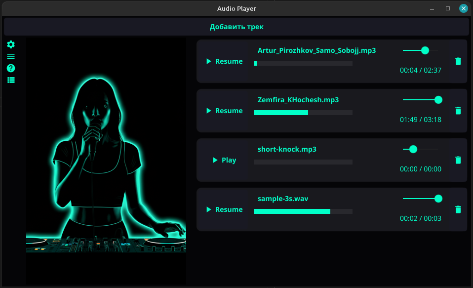

# Neon Player 🎧

Музыкальный плеер на языке **Go** с использованием графической библиотеки **Fyne**. Особенности проекта — неоновый дизайн, высокая стабильность воспроизведения и кастомная обработка аудио-потоков.

## ✨ Ключевые особенности
* **Multi-Track Playback**: Уникальная возможность запускать несколько треков одновременно. Каждый трек работает в своей горутине со своим независимым плеером.
* **Smart Format Detection**: Поддержка MP3 и WAV даже при неверном расширении файла. Плеер определяет тип контента по сигнатуре данных, а не по имени.
* **Individual Control**: Каждый активный трек имеет собственный регулятор громкости и панель навигации (Seek), работающие в реальном времени.
* **Thread-Safe Seeking**: Кастомная синхронизация через Mutex предотвращает конфликты при одновременном чтении и перемотке аудиопотока.

## 🛠 Технологический стек
* **Язык:** [Go](https://go.dev/) (Golang)
* **UI Фреймворк:** [Fyne v2](https://fyne.io/)
* **Аудио-движок:** [Playsound](https://github.com/Roman77St/playsound)
* **Синхронизация:** Mutex-блокировки для безопасной работы с потоком.

## 📦 Установка и запуск

1. Убедитесь, что у вас установлены зависимости для Fyne (C-компилятор и графические библиотеки). Подробнее в [документации Fyne](https://developer.fyne.io/started/).

2. Склонируйте репозиторий:
   ```bash
   git clone git@github.com:Roman77St/neon_player.git

3. Запустите проект:
   ```bash
   go run main.go

## 📸 Скриншоты


